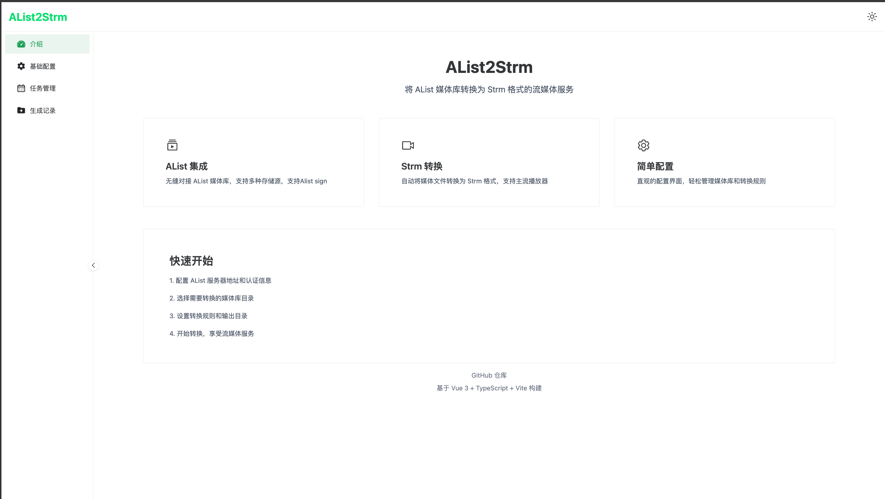
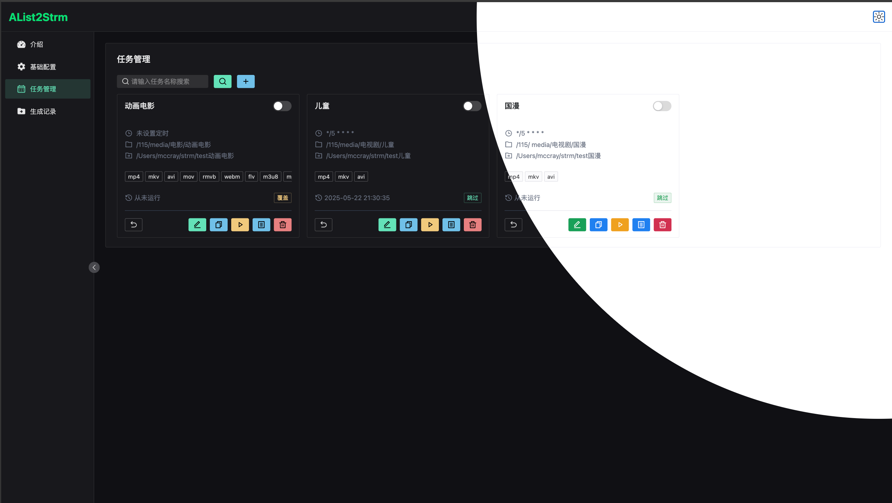
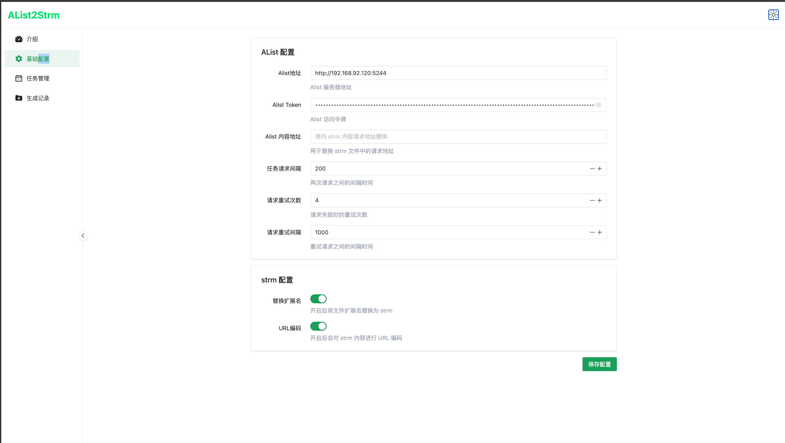
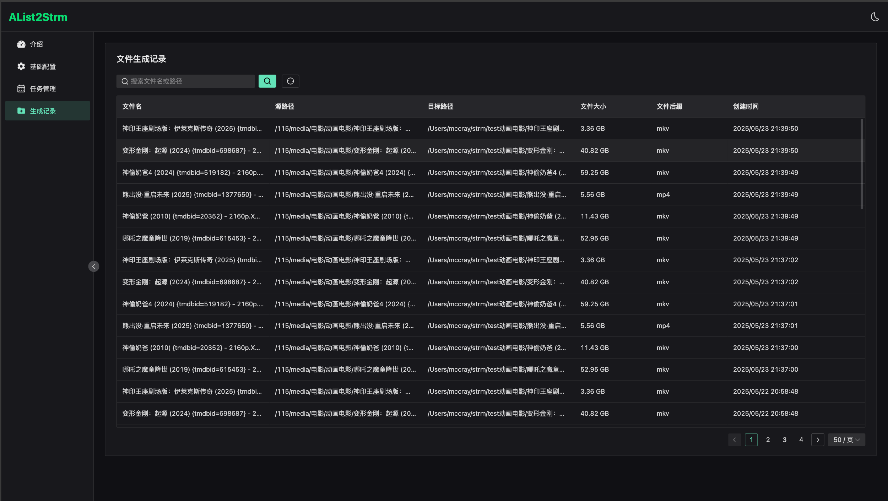

# AList2Strm

AList2Strm 是一个用于将 AList 媒体文件转换为 Strm 格式的工具，支持定时任务和批量处理。


## 功能特性

- 🎯 支持从 AList 获取媒体文件列表
- 🔄 自动将媒体文件转换为 Strm 格式
- ⏰ 支持定时任务调度
- 📊 任务执行日志记录
- 🔍 文件处理历史记录
- ⚙️ 可配置的文件后缀和路径
- 🚀 支持批量处理和

## 技术栈

### 后端
- Node.js
- Express.js
- TypeScript
- Sequelize
- node-cron

### 前端
- Vue 3
- TypeScript
- Naive UI
- Vite

## 界面一览

#### 移动端适配
[](https://github.com/MccRay-s/alist2strm/raw/main/screenshot/screenshot20250524011706@2x.png)

#### 首页
[](https://github.com/MccRay-s/alist2strm/raw/main/screenshot/screenshot20250524011249@2x.png)

#### 任务管理
[](https://github.com/MccRay-s/alist2strm/raw/main/screenshot/screenshot20250524011222@2x.png)

#### 配置管理
[](https://github.com/MccRay-s/alist2strm/raw/main/screenshot/screenshot20250524011243@2x.png)

#### 文件记录
[](https://github.com/MccRay-s/alist2strm/raw/main/screenshot/screenshot20250524011029@2x.png)

## 功能计划
- Emby 入库通知，strm 实时入库支持
- 用户授权中心，公网暴露的情况确实挺不安全的
- strm 失效检测，预估方案应该是每个 strm 都需要一次网络请求来判断是否有效
- Telgram 消息通知，具体通知规则还没想好


## 项目结构

```
alist2strm/
├── packages/
│   ├── server/          # 后端服务
│   └── frontend/        # 前端应用
├── package.json
└── README.md
```

## 安装说明

1. 克隆项目
```bash
git clone https://github.com/MccRay-s/alist2strm
cd alist2strm
```

2. 安装依赖
```bash
# 安装根目录依赖
npm install

# 安装后端依赖
cd packages/server
npm install

# 安装前端依赖
cd ../frontend
npm install
```

3. 配置环境变量
```bash
# 在 packages/server 目录下创建 .env 文件
cp .env.example .env
```

4. 修改配置
编辑 `.env` 文件，配置数据库连接和 AList 相关信息。

## 使用说明

1. 启动后端服务
```bash
cd packages/server
npm run dev
```

2. 启动前端应用
```bash
cd packages/frontend
npm run dev
```

3. 访问应用
打开浏览器访问 `http://localhost:3000`

## 任务配置

1. 创建新任务
   - 设置任务名称
   - 配置源路径（AList 路径）
   - 设置目标路径
   - 选择需要处理的文件后缀
   - 配置定时执行计划（Cron 表达式）

2. 任务管理
   - 启用/禁用任务
   - 手动执行任务
   - 查看执行日志
   - 监控任务状态

## 开发说明

### 后端开发
```bash
cd packages/server
npm run dev
```

### 前端开发
```bash
cd packages/frontend
npm run dev
```

### 构建部署
```bash
# 构建前端
cd packages/frontend
npm run build

# 构建后端
cd packages/server
npm run build
```

### 更新日志
V1.0.1: `2025-05-22 23:45`
- 任务界面调整，Table View 改成 Cards View
- 任务编辑取消cron 必填项目
  
V1.0.2: `2025-05-24 01:28`
- 添加参数 `Alist外网地址`，`strm` 内容优先使用外网地址生成
- 添加参数 `strm` 生成选项 `替换扩展名`，开启后文件名称显示为 `xxx_4k.strm`，未开启则显示为 `xxx_4k.mp4.strm`
- 添加参数 `strm` 生成选项 `URL编码`，启用后会对 `strm` 内容进行URL 编码
- 适配移动端界面
### Bugs 
1. AList 原路径，未编码导致API 调用异常，例如：`我的接收/【BD-ISO】`

## 许可证

MIT License 