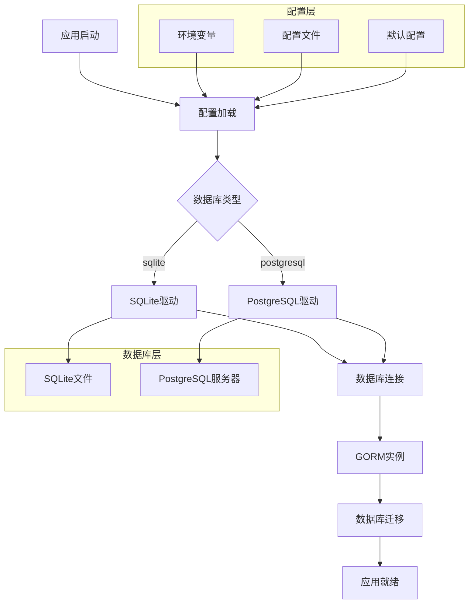
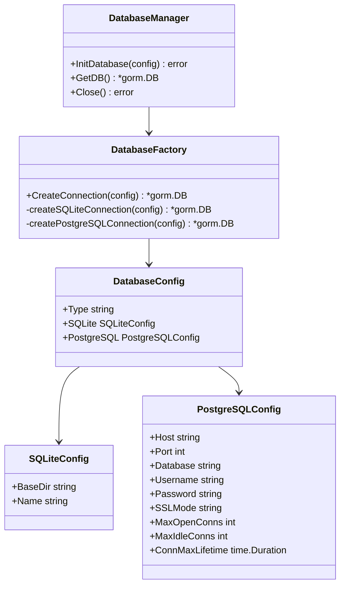

# Design Document

## Overview

本设计文档描述了如何为alist2strm项目新增PostgreSQL数据源支持。设计采用配置驱动的方式，通过抽象数据库初始化逻辑，使系统能够根据配置选择使用SQLite或PostgreSQL作为数据存储后端。设计保持向后兼容性，现有代码无需修改即可支持新的数据库类型。

核心设计原则：
- 配置驱动：通过配置文件和环境变量控制数据库选择
- 向后兼容：现有SQLite配置和代码保持不变
- 抽象化：通过工厂模式抽象数据库初始化逻辑
- 可扩展：为未来支持其他数据库类型预留扩展空间

## Architecture

### 系统架构图



### 组件关系图



## Components and Interfaces

### 1. 配置组件 (Config Component)

**职责：** 管理数据库配置参数，支持多种数据库类型的配置

**接口设计：**
```go
type DatabaseConfig struct {
    Type       string            `json:"type"`       // "sqlite" 或 "postgresql"
    SQLite     SQLiteConfig      `json:"sqlite"`
    PostgreSQL PostgreSQLConfig  `json:"postgresql"`
}

type SQLiteConfig struct {
    BaseDir string `json:"base_dir"`
    Name    string `json:"name"`
}

type PostgreSQLConfig struct {
    Host            string        `json:"host"`
    Port            int           `json:"port"`
    Database        string        `json:"database"`
    Username        string        `json:"username"`
    Password        string        `json:"password"`
    SSLMode         string        `json:"ssl_mode"`
    MaxOpenConns    int           `json:"max_open_conns"`
    MaxIdleConns    int           `json:"max_idle_conns"`
    ConnMaxLifetime time.Duration `json:"conn_max_lifetime"`
}
```

**环境变量映射：**
- `DB_TYPE`: 数据库类型 (sqlite/postgresql)
- `DB_HOST`: PostgreSQL主机地址
- `DB_PORT`: PostgreSQL端口
- `DB_NAME`: 数据库名称
- `DB_USERNAME`: 用户名
- `DB_PASSWORD`: 密码
- `DB_SSL_MODE`: SSL模式
- `DB_MAX_OPEN_CONNS`: 最大打开连接数
- `DB_MAX_IDLE_CONNS`: 最大空闲连接数
- `DB_CONN_MAX_LIFETIME`: 连接最大生存时间

### 2. 数据库工厂组件 (Database Factory Component)

**职责：** 根据配置创建相应的数据库连接

**接口设计：**
```go
type DatabaseFactory interface {
    CreateConnection(config *DatabaseConfig) (*gorm.DB, error)
}

type DefaultDatabaseFactory struct{}

func (f *DefaultDatabaseFactory) CreateConnection(config *DatabaseConfig) (*gorm.DB, error)
func (f *DefaultDatabaseFactory) createSQLiteConnection(config *SQLiteConfig) (*gorm.DB, error)
func (f *DefaultDatabaseFactory) createPostgreSQLConnection(config *PostgreSQLConfig) (*gorm.DB, error)
```

### 3. 数据库管理组件 (Database Manager Component)

**职责：** 管理数据库连接生命周期，提供统一的数据库访问接口

**接口设计：**
```go
type DatabaseManager interface {
    InitDatabase(config *DatabaseConfig) error
    GetDB() *gorm.DB
    Close() error
    HealthCheck() error
}

type DefaultDatabaseManager struct {
    db      *gorm.DB
    factory DatabaseFactory
}
```

### 4. 连接池管理组件 (Connection Pool Component)

**职责：** 管理PostgreSQL连接池配置和监控

**功能特性：**
- 连接池大小配置
- 连接超时管理
- 连接健康检查
- 连接池监控指标

## Data Models

现有的数据模型无需修改，GORM会自动处理不同数据库之间的差异。但需要注意以下几点：

### 数据类型映射

| GORM类型 | SQLite | PostgreSQL |
|----------|--------|------------|
| string   | TEXT   | VARCHAR    |
| int      | INTEGER| INTEGER    |
| uint     | INTEGER| INTEGER    |
| bool     | INTEGER| BOOLEAN    |
| time.Time| DATETIME| TIMESTAMP  |
| []byte   | BLOB   | BYTEA      |

### 索引和约束

PostgreSQL支持更丰富的索引类型和约束：
- 复合索引
- 部分索引
- 唯一约束
- 外键约束
- 检查约束

### 迁移兼容性

GORM的AutoMigrate功能会自动处理：
- 表创建
- 列添加/修改
- 索引创建
- 约束添加

## Error Handling

### 1. 连接错误处理

```go
type DatabaseError struct {
    Type    string
    Message string
    Cause   error
}

func (e *DatabaseError) Error() string {
    return fmt.Sprintf("数据库错误 [%s]: %s", e.Type, e.Message)
}
```

### 2. 错误分类

- **配置错误：** 配置参数缺失或无效
- **连接错误：** 无法连接到数据库服务器
- **认证错误：** 用户名或密码错误
- **权限错误：** 数据库访问权限不足
- **迁移错误：** 数据库表结构迁移失败

### 3. 错误恢复策略

- **连接重试：** 实现指数退避重试机制
- **降级处理：** 在PostgreSQL不可用时可选择降级到SQLite
- **健康检查：** 定期检查数据库连接状态
- **优雅关闭：** 应用关闭时正确关闭数据库连接

### 4. 日志记录

```go
type DatabaseLogger struct {
    logger *zap.Logger
}

func (l *DatabaseLogger) LogMode(level logger.LogLevel) logger.Interface
func (l *DatabaseLogger) Info(ctx context.Context, msg string, data ...interface{})
func (l *DatabaseLogger) Warn(ctx context.Context, msg string, data ...interface{})
func (l *DatabaseLogger) Error(ctx context.Context, msg string, data ...interface{})
func (l *DatabaseLogger) Trace(ctx context.Context, begin time.Time, fc func() (string, int64), err error)
```

## Testing Strategy

### 1. 单元测试

**测试范围：**
- 配置解析和验证
- 数据库工厂创建连接
- 错误处理逻辑
- 连接池配置

**测试工具：**
- Go标准testing包
- testify/assert用于断言
- testify/mock用于模拟

**示例测试：**
```go
func TestDatabaseFactory_CreatePostgreSQLConnection(t *testing.T) {
    factory := &DefaultDatabaseFactory{}
    config := &PostgreSQLConfig{
        Host:     "localhost",
        Port:     5432,
        Database: "test_db",
        Username: "test_user",
        Password: "test_pass",
        SSLMode:  "disable",
    }
    
    db, err := factory.createPostgreSQLConnection(config)
    assert.NoError(t, err)
    assert.NotNil(t, db)
}
```

### 2. 集成测试

**测试环境：**
- Docker容器运行PostgreSQL
- 临时SQLite文件
- 测试数据库隔离

**测试场景：**
- 数据库连接建立
- 表结构迁移
- CRUD操作
- 事务处理
- 连接池行为

**测试配置：**
```go
func setupTestDatabase(dbType string) (*gorm.DB, func()) {
    switch dbType {
    case "postgresql":
        return setupPostgreSQLTest()
    case "sqlite":
        return setupSQLiteTest()
    }
}
```

### 3. 性能测试

**测试指标：**
- 连接建立时间
- 查询响应时间
- 并发连接处理
- 内存使用情况

**基准测试：**
```go
func BenchmarkDatabaseOperations(b *testing.B) {
    db := setupTestDatabase("postgresql")
    defer db.Close()
    
    b.ResetTimer()
    for i := 0; i < b.N; i++ {
        // 执行数据库操作
    }
}
```

### 4. 兼容性测试

**测试矩阵：**
- SQLite → PostgreSQL迁移
- PostgreSQL → SQLite降级
- 不同PostgreSQL版本兼容性
- 现有业务逻辑兼容性

**自动化测试：**
- CI/CD管道集成
- 多环境测试
- 回归测试
- 性能回归检测